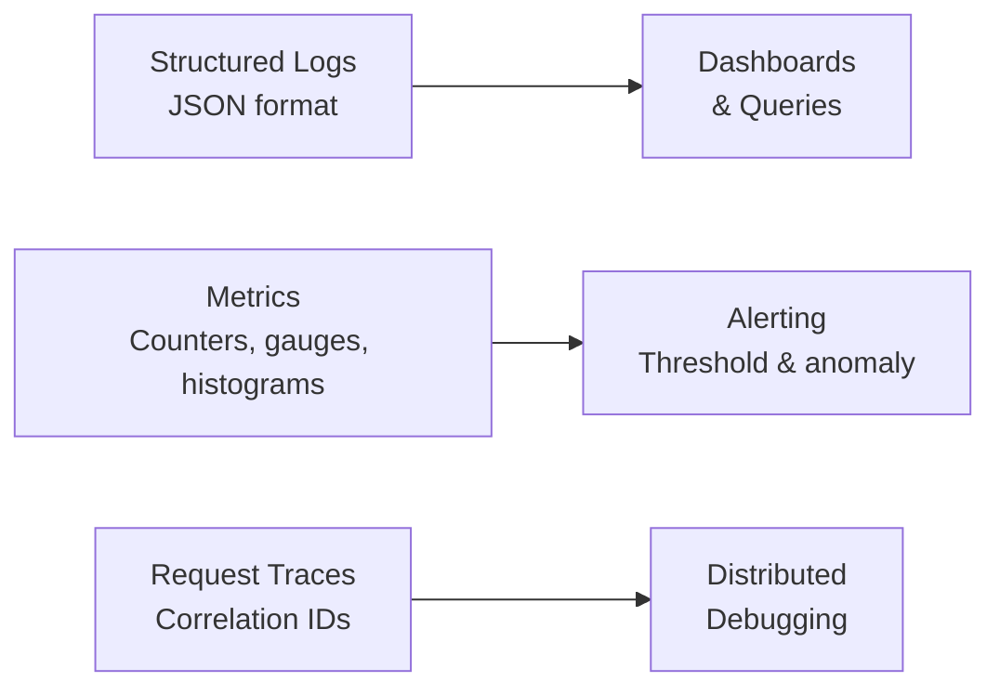

# Monitoring and Observability

- Document owner: Engineering and DevOps
- Last reviewed: 2026-03-24
- Primary use: Metrics, logging, tracing, and alerting for SBTM services

## Purpose

Define the observability strategy for SBTM. Safety-critical operations (GPS tracking, emergency alerts, presence detection) require proactive monitoring to detect failures before they impact students and parents.

## Three Pillars



## Logging

### Format

All services emit structured JSON logs:

```json
{
  "timestamp": "2026-03-24T08:15:42.123Z",
  "level": "info",
  "service": "gps-tracking",
  "requestId": "req-abc-123",
  "tenantId": "school-001",
  "action": "location.received",
  "message": "GPS location recorded",
  "vehicleId": "bus-042",
  "duration": 15
}
```

### Log Levels

| Level | Use |
|---|---|
| `error` | Unrecoverable failures, unhandled exceptions |
| `warn` | Degraded operation, approaching limits |
| `info` | Business events (location recorded, alert created, student boarded) |
| `debug` | Detailed internal state (development/staging only) |

### PII Rules

- Never log student names, guardian contact info, or home addresses.
- Log entity IDs only (studentId, guardianId, schoolId).
- See data classification guide for tier-specific rules.

## Metrics

### Key Metrics per Service

| Metric | Type | Alert Threshold |
|---|---|---|
| `http_request_duration_seconds` | Histogram | p95 > 500ms for 5 min |
| `http_request_total` | Counter (by status code) | 5xx rate > 1% for 5 min |
| `db_connection_pool_active` | Gauge | > 80% pool capacity |
| `redis_queue_depth` | Gauge | > 1000 pending jobs |
| `websocket_connections` | Gauge | Sudden drop > 50% |

### GPS-Specific Metrics

| Metric | Type | Alert Threshold |
|---|---|---|
| `gps_updates_per_second` | Counter | < expected rate for active routes |
| `gps_staleness_seconds` | Gauge | > 30s for any active bus |

### Alert-Specific Metrics

| Metric | Type | Alert Threshold |
|---|---|---|
| `alert_creation_to_notification_seconds` | Histogram | p95 > 5s |
| `alert_delivery_failures` | Counter | Any failure |

## Tracing

- Assign a `requestId` at the API Gateway for each incoming request.
- Propagate the `requestId` through all downstream service calls and queue jobs.
- Include `requestId` in all log entries for request correlation.
- Long-term: adopt OpenTelemetry for distributed tracing across services.

## Health Dashboard

Minimum dashboard panels:

- Service health status (up/down for each service)
- Request rate and latency per service
- Error rate per service
- Database and Redis health
- Active WebSocket connections
- Queue depth and processing rate
- GPS update rate vs. expected rate for active routes

## Related Documents

- [deployment_guidelines.md](deployment_guidelines.md) — Deployment procedures
- [incident_response.md](incident_response.md) — Incident management
- [../04_coding_standards/general_coding.md](../04_coding_standards/general_coding.md) — Logging conventions
