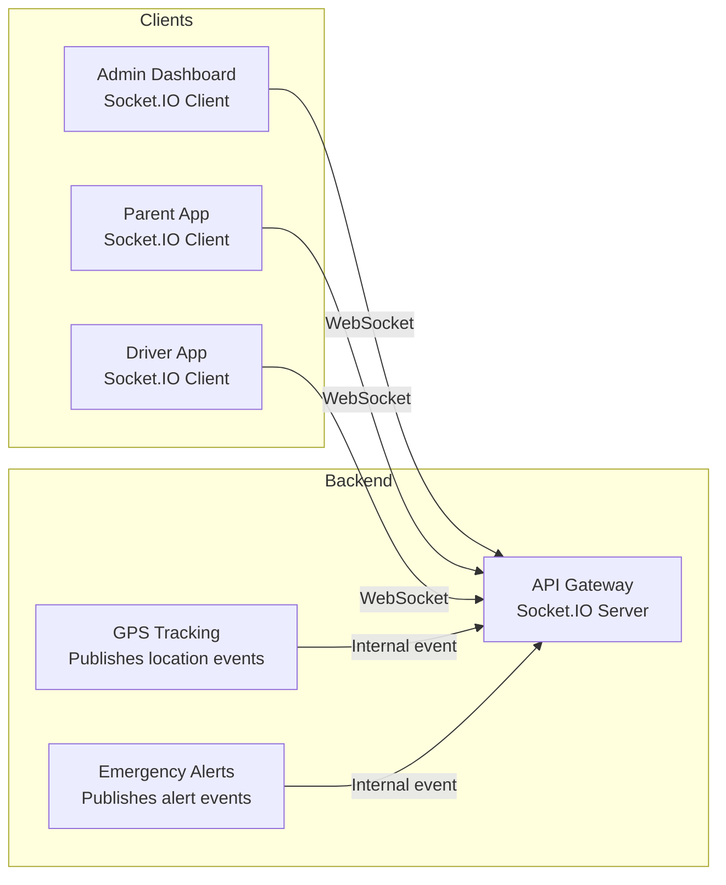

# Socket.IO and SSE Guidelines

- Document owner: Engineering
- Last reviewed: 2026-03-24
- Primary use: Real-time communication patterns for SBTM (WebSocket via Socket.IO, Server-Sent Events)

## Purpose

Define real-time communication standards for SBTM. Real-time updates are critical for GPS tracking, emergency alerts, and presence notifications.

## Technology Choice

| Protocol | Use Case | Service |
|---|---|---|
| **Socket.IO** (WebSocket) | Bidirectional real-time: GPS location broadcast, alert pushes | API Gateway, GPS Tracking |
| **SSE** (Server-Sent Events) | Server-to-client streaming (planned) | Future: notification feeds |

Socket.IO is the primary real-time transport in SBTM. SSE may be introduced for simple notification streaming.

## Socket.IO Architecture



## Authentication

- Authenticate Socket.IO connections during the handshake using the JWT token:

```typescript
// Server (NestJS Gateway)
@WebSocketGateway({
  cors: { origin: allowedOrigins },
})
export class TrackingGateway implements OnGatewayConnection {
  async handleConnection(client: Socket) {
    const token = client.handshake.auth.token;
    try {
      const user = await this.authService.verifyToken(token);
      client.data.user = user;
      client.join(`school:${user.schoolId}`); // Tenant room
    } catch {
      client.disconnect();
    }
  }
}
```

- Reject unauthenticated connections immediately.
- Store user context on the socket instance for use in event handlers.

## Room Strategy (Tenant Isolation)

- Use rooms to isolate real-time events by tenant:

| Room Pattern | Purpose |
|---|---|
| `school:<schoolId>` | All events for a school |
| `route:<routeId>` | GPS updates for a specific route |
| `alert:<schoolId>` | Emergency alerts for a school |

- Clients join rooms based on their JWT claims and subscriptions.
- Never broadcast to all connected clients — always emit to a specific room.

```typescript
// Emit GPS update to route subscribers only
this.server.to(`route:${routeId}`).emit('location:update', locationData);
```

## Event Naming Conventions

```
<domain>:<action>
```

| Event | Direction | Payload |
|---|---|---|
| `location:update` | Server → Client | `{ vehicleId, lat, lng, timestamp, routeId }` |
| `alert:created` | Server → Client | `{ alertId, type, schoolId, message, timestamp }` |
| `alert:acknowledged` | Server → Client | `{ alertId, acknowledgedBy, timestamp }` |
| `presence:boarded` | Server → Client | `{ studentId, vehicleId, routeId, timestamp }` |
| `presence:alighted` | Server → Client | `{ studentId, stopId, timestamp }` |

## Client-Side Patterns

```typescript
// Custom hook for real-time GPS
export function useLocationUpdates(routeId: string) {
  const socket = useSocket();
  const [location, setLocation] = useState<LocationUpdate | null>(null);

  useEffect(() => {
    socket.emit('subscribe:route', { routeId });
    socket.on('location:update', (data: LocationUpdate) => {
      if (data.routeId === routeId) setLocation(data);
    });

    return () => {
      socket.emit('unsubscribe:route', { routeId });
      socket.off('location:update');
    };
  }, [socket, routeId]);

  return location;
}
```

## Reconnection and Reliability

- Enable Socket.IO auto-reconnect with exponential backoff.
- On reconnection, re-authenticate and re-subscribe to rooms.
- For critical events (emergency alerts), also deliver via push notification as a fallback.
- Log disconnection and reconnection events for monitoring.

## Performance

- Throttle high-frequency events (GPS) to avoid overwhelming clients. Emit at most once per second per route.
- Use binary payloads only if JSON serialization becomes a bottleneck.
- Monitor WebSocket connection count and message throughput.

## Related Documents

- [react_vite.md](react_vite.md) — Web frontend Socket.IO integration
- [react_native_expo.md](react_native_expo.md) — Mobile Socket.IO integration
- [../07_deployment_operations/monitoring_observability.md](../07_deployment_operations/monitoring_observability.md) — WebSocket monitoring
