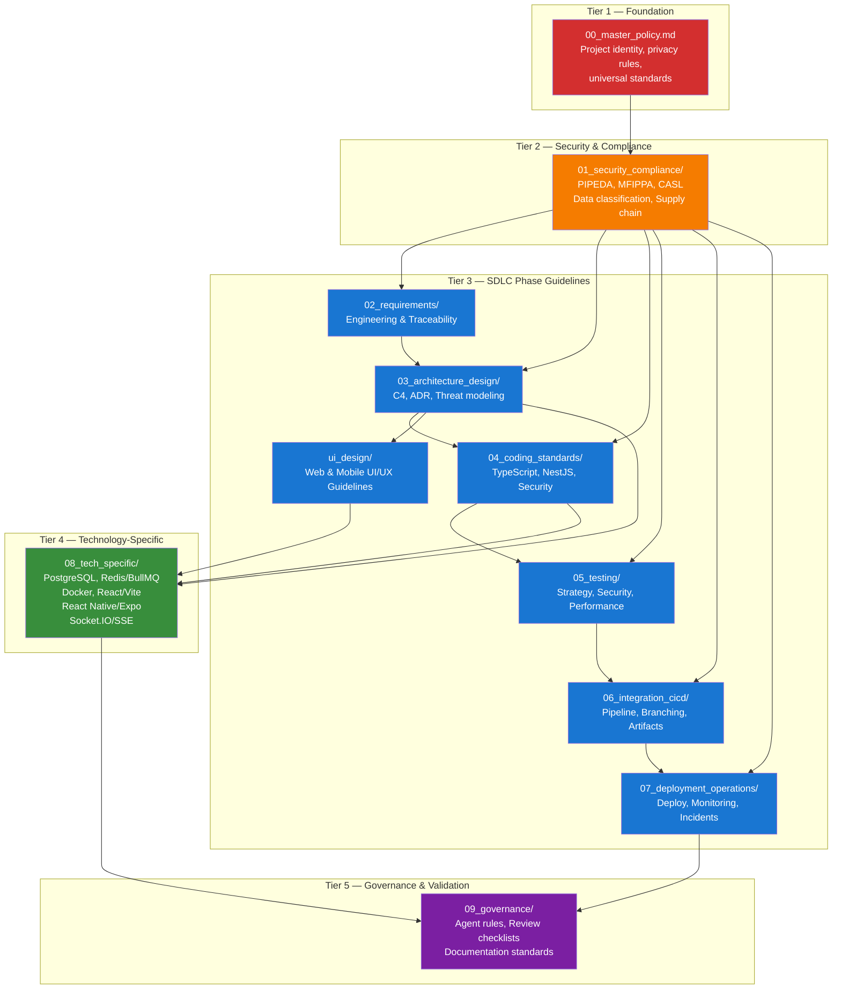

# SDLC Guidelines Framework — Index

- Document owner: Product and Engineering
- Last reviewed: 2026-03-24
- Primary use: Navigation index for SDLC guidelines with dependency hierarchy and loading order

## Purpose

This directory contains the SDLC Guidelines Framework for SBTM — a hierarchical set of policy files that AI agents and developers follow to enforce privacy, quality, and compliance standards across all development activities.

Guidelines are organized in a 5-tier dependency hierarchy. Agents must load from the top tier down, ensuring foundational policies are always in effect before technology-specific guidance.

## Guideline Dependency Hierarchy



## Loading Order by Agent Task

| Agent Task | Required Files (load in order) |
|---|---|
| **Any task** | `00_master_policy.md` → `01_security_compliance/data_classification.md` |
| **Requirements** | + `02_requirements/requirements_engineering.md` → `traceability.md` |
| **Architecture** | + `03_architecture_design/architecture_guidelines.md` → `design_guidelines.md` → `threat_modeling.md` |
| **TypeScript coding** | + `04_coding_standards/general_coding.md` → `typescript_standards.md` → `secure_coding.md` |
| **NestJS services** | + `04_coding_standards/general_coding.md` → `nestjs_standards.md` → `secure_coding.md` |
| **Testing** | + `05_testing/testing_strategy.md` → `security_testing.md` → `performance_testing.md` |
| **CI/CD** | + `06_integration_cicd/ci_cd_pipeline.md` → `branching_strategy.md` → `artifact_management.md` |
| **Deployment** | + `07_deployment_operations/deployment_guidelines.md` → `monitoring_observability.md` → `incident_response.md` |
| **PostgreSQL** | + `08_tech_specific/postgresql_postgis.md` |
| **Redis/BullMQ** | + `08_tech_specific/redis_bullmq.md` |
| **React/Vite** | + `08_tech_specific/react_vite.md` |
| **React Native** | + `08_tech_specific/react_native_expo.md` |
| **Socket.IO/SSE** | + `08_tech_specific/socketio_sse.md` |
| **Docker** | + `development/docker_development.md` → `08_tech_specific/docker_guidelines.md` |
| **UI Design** | + `ui_design/ui_design_guidelines.md` |
| **Review/Governance** | + `09_governance/agent_governance.md` → `review_checklists.md` |

## Directory Structure

```
docs/sdlc_guidelines/
├── README.md                                ← You are here
├── 00_master_policy.md                      ← ALWAYS LOAD FIRST
├── 01_security_compliance/
│   ├── privacy_compliance.md                ← PIPEDA, MFIPPA, CASL mapping
│   ├── data_classification.md               ← Student PII tiers and handling
│   └── supply_chain_security.md             ← npm, Docker, CI dependency vetting
├── 02_requirements/
│   ├── requirements_engineering.md          ← Requirement capture format (FR/NFR/PR/SR)
│   └── traceability.md                      ← Bidirectional traceability matrix
├── 03_architecture_design/
│   ├── architecture_guidelines.md           ← C4 model, Mermaid conventions, ADR format
│   ├── design_guidelines.md                 ← Microservice and event-driven patterns
│   └── threat_modeling.md                   ← STRIDE for student safety and tenant isolation
├── 04_coding_standards/
│   ├── general_coding.md                    ← Language-agnostic rules
│   ├── typescript_standards.md              ← TypeScript conventions
│   ├── nestjs_standards.md                  ← NestJS service patterns
│   └── secure_coding.md                     ← OWASP, input validation, JWT handling
├── 05_testing/
│   ├── testing_strategy.md                  ← Test pyramid, coverage targets
│   ├── security_testing.md                  ← Auth, RBAC, tenant isolation testing
│   └── performance_testing.md               ← GPS ingest, WebSocket, queue testing
├── 06_integration_cicd/
│   ├── branching_strategy.md                ← Git workflow and branch naming
│   ├── ci_cd_pipeline.md                    ← Quality gates and CI stages
│   └── artifact_management.md               ← Docker images, npm packages
├── 07_deployment_operations/
│   ├── deployment_guidelines.md             ← Docker Compose and production K8s
│   ├── monitoring_observability.md          ← Health checks, metrics, alerts
│   └── incident_response.md                 ← Child safety incidents, data breaches
├── 08_tech_specific/
│   ├── postgresql_postgis.md                ← PostGIS, RLS, migrations
│   ├── redis_bullmq.md                      ← Queuing, caching, pub/sub patterns
│   ├── docker_guidelines.md                 ← Multi-stage builds, security contexts
│   ├── react_vite.md                        ← Admin dashboard, parent portal
│   ├── react_native_expo.md                 ← Driver mobile app
│   └── socketio_sse.md                      ← Real-time communication patterns
├── 09_governance/
│   ├── agent_governance.md                  ← AI coding agent guardrails
│   ├── review_checklists.md                 ← PR review, security, privacy checklists
│   └── documentation_standards.md           ← Documentation conventions
├── ui_design/
│   └── ui_design_guidelines.md              ← UI/UX standards for web and mobile apps
└── development/
    └── docker_development.md                ← Local development with Docker Compose
```

## Related Documents

- [00_master_policy.md](00_master_policy.md) — Foundation policy
- [../Governance/DocumentationPolicy.md](../Governance/DocumentationPolicy.md) — Documentation governance
- [../Business/Requirements.md](../Business/Requirements.md) — Business requirements baseline
- [../Design/Architecture.md](../Design/Architecture.md) — v1 target architecture
- [../Test/TestingGuide.md](../Test/TestingGuide.md) — Operational testing guide
